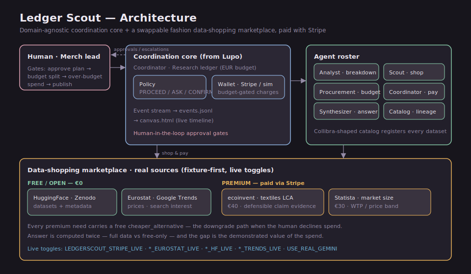

# Architecture

Domain-agnostic coordination core (adapted from [Lupo](../Lupo/lupo-orchestrator/)) plus a swappable fashion data-shopping layer.



## One line

Ledger Scout is a **coordination layer** that orchestrates research agents and a human merch lead to break a question down into data needs, shop real datasets within an **EUR budget**, **pay for premium datasets with Stripe**, register them in a governed catalog, and produce a quantitative brief with lineage.

## The two layers

### Domain-agnostic core (the product)

| Component | Responsibility |
|-----------|----------------|
| **Coordinator** | Routes work, holds research ledger, sequences human gates, settles each purchase |
| **Policy** | `PROCEED` / `ASK` / `CONFIRM` on overspend and publish |
| **Research ledger** | Shared state: data needs (+ rationale), acquisitions, paid_eur, payment ids, metrics |
| **Wallet** | EUR budget that pays via Stripe PaymentIntents (live) or a deterministic simulator (offline) |
| **Event stream** | `data/events.jsonl` — makes coordination visible |
| **Human channel** | Scripted offline; swappable on build day |

### Swappable domain layer (fashion data shopping)

| Component | Responsibility |
|-----------|----------------|
| **Analyst** | Brief → structured **breakdown** of `DataNeed`s (need · why · source · free/paid) |
| **Scout** | Shop the data **marketplace**, rank free + premium candidates |
| **Procurement** | EUR budget split across premium needs + **slack reallocation** |
| **Synthesizer** | Trend score, claim/LCA summary, market metrics, lineage |
| **Catalog** | Collibra-shaped asset metadata (license, quality, tier, payment id) |
| **Marketplace + sources** | Real datasets (fixtures) + live Eurostat / HuggingFace / Trends fetchers |

## Coordination flow

```
Brief + EUR budget
    → Analyst breakdown      [human: approve / amend]   "to answer this we need A,B,C,D"
    → Scout shops each need  → Procurement allocate      [human: approve split]
    → Coordinator settles each dataset:
         free            → acquire (€0)
         premium ≤ slice → pay (real Stripe charge)
         over slice      → reallocate slack  (agent-to-agent, no human)
         over budget     → ASK human → approve increase  OR  drop to free tier
    → Synthesizer + Catalog
    → Publish brief          [human: confirm]
```

## Same pattern as Lupo

| Lupo (shopping) | Ledger Scout (research) |
|-----------------|-------------------------|
| Outfit components | Data needs (with rationale) |
| € budget | EUR research budget (real Stripe charges) |
| Vinted listings | Free + premium dataset candidates |
| Seller price haggle | Slack reallocation + human budget-increase approval |
| Purchase confirm | Publish brief confirm |
| Traceability table | Lineage + catalog |

## Generalization thesis

Change the roster and source adapters — outfit shopper becomes **benchmark market**, **returns exchange**, or **industrial RFQ research**. The coordination layer is unchanged.

See also: `docs/HACKATHON_NOTE.md`, `docs/MVP_SCOPE.md`.
