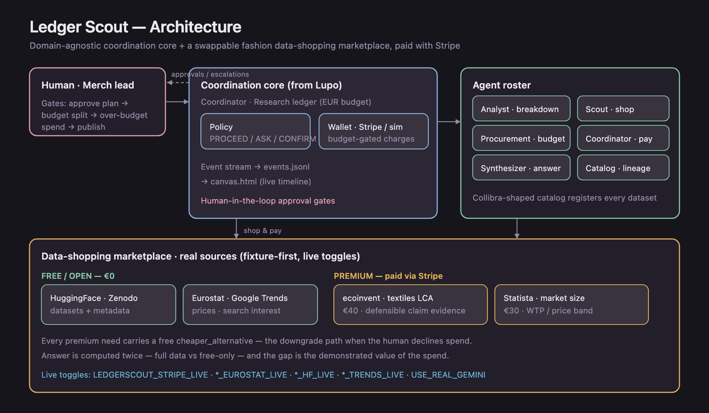

# Ledger Scout

**Agentic data shopping for fashion sustainability** — Collibra hackathon.

A merchandiser asks one question. A coordinated org of agents **breaks it down** into the
datasets needed to answer it, **shops real data sources** (free/open + premium), **pays for
premium datasets with Stripe**, registers everything in a **Collibra-shaped catalog**, and
returns a **quantitative brief with lineage** — not vibes.

Three things are front and centre:

1. **Agentic breakdown** — *"to answer this we need A, B, C, D"*, each with a rationale, a real
   source, and a free/paid tier (the Analyst's `plan` event).
2. **Budget negotiation with the human** — agents pay autonomously within budget, **reallocate
   slack** between datasets when one over-runs its slice, and **ask the human to approve a budget
   increase** when a premium dataset would blow the total. This replaces Lupo's Vinted seller-haggle.
3. **Good use of what we shopped** — every dataset emits a *utilization trace* (fields → metric →
   sub-question), and the brief answers the question **twice**: with everything we bought vs.
   **free-data-only**. The gap is the demonstrated value of the spend — typically a legally
   defensible sustainability claim (92% vs 58% verifiable) and a real price band.

Built on the coordination patterns from [Lupo](../Lupo-orchestrator/) (multi-agent + human gates +
shared ledger + budget arbitration), with the domain swapped from outfit shopping to governed
research datasets, and the payment rail wired to **real Stripe charges**.

---

## Architecture



<sub>(Diagram source: [`frontend/architecture.svg`](frontend/architecture.svg) — the PNG is committed because GitHub does not render relative-path SVGs.)</sub>

The **coordination core** is domain-agnostic. The **data marketplace** layer is swappable
(free/open datasets + premium catalog today; your data marketplace tomorrow). Details:
[`ARCHITECTURE.md`](ARCHITECTURE.md).

---

## Quick start (offline — no keys, deterministic)

```bash
cd LedgerScout
python3 scripts/run_research.py                                 # knitwear (primary demo)
LEDGERSCOUT_SCENARIO=sustainable_denim python3 scripts/run_research.py
python3 tests/test_research_mission.py                          # smoke tests
```

Open the canvas with the **stream server** (serves the canvas *and* runs missions live):

```bash
python3 scripts/serve.py        # then open http://localhost:8000/frontend/canvas.html
```

- The three **recorded** tabs replay golden runs (fully offline).
- **▶ Run** streams a *live* mission step by step into the canvas — each agent event appears as
  it happens, and with "real Stripe charges" ticked it creates genuine test-mode PaymentIntents
  as the payment steps are revealed.
- Deep links: `?s=knitwear|denim|activewear|live` (recorded) or `?run=knitwear[&live=1]` (auto-run live).

> A plain `python3 -m http.server 8000` (from the repo root) also works for the recorded tabs,
> but the ▶ Run button needs `scripts/serve.py` (it provides the `/api/run` stream).

---

## Real payments (Stripe sandbox)

Agents pay for premium datasets with **real test-mode PaymentIntents** — genuine succeeded charges
in your Stripe dashboard, no balance/funding needed.

```bash
cp .env.example .env                          # add STRIPE_SECRET_KEY=sk_test_...
python3 -m ledger_scout.payments.verify_stripe --amount 40     # prove the rail (real charge)
LEDGERSCOUT_STRIPE_LIVE=1 python3 scripts/run_research.py       # mission pays for real
```

With the toggle off, a deterministic **local simulator** mirrors the same budget/approval logic, so
the demo always runs offline. (We originally targeted Stripe Issuing, but EU sandboxes can't fund the
test Issuing balance — see [`docs/DATA_SOURCES.md`](docs/DATA_SOURCES.md).)

---

## Demo scenarios

| Scenario | Question | Budget move showcased |
|----------|----------|------------------------|
| `knitwear` | Recycled-cotton knitwear AW26 in Benelux + defend the "recycled cotton" claim | Pays for LCA evidence autonomously, then **asks the human to approve a budget increase** for the market benchmark |
| `sustainable_denim` | €79–99 sustainable denim in Germany SS27 | LCA over-runs its slice → agents **reallocate slack autonomously** (no human) and stay in budget |
| `recycled_activewear` | "Recycled polyester" activewear in France on a tight €35 budget | Human **declines the spend** → agent **downgrades to the free tier**; brief honestly flags the claim as "at risk" |

Together they cover the full arbitration space: **approve more budget**, **reallocate autonomously**, **decline → downgrade**.

Full beats: [`docs/DEMO_SCENARIOS.md`](docs/DEMO_SCENARIOS.md). 5-minute pitch + live-run script: [`docs/DEMO_RUNBOOK.md`](docs/DEMO_RUNBOOK.md).

---

## Real datasets

| Need | Source | Tier |
|------|--------|------|
| resale_demand | HuggingFace second-hand clothing (Wargön/RISE, 43k items) · Eurostat Comext worn textiles | free |
| search_interest | Google Trends (pytrends) | free |
| material_composition | H&M + Uniqlo garment-variant dataset (Zenodo, 47k) | free |
| **lca_impact** | **ecoinvent v3.12 textiles LCA** (recycled vs conventional cotton) | **premium €40** |
| **market_benchmark** | **Statista** sustainable apparel market | **premium €30** |

Free candidates can be fetched live (Eurostat / HuggingFace / Trends toggles); premium datasets are
real, license-gated references the agent pays for. See [`docs/DATA_SOURCES.md`](docs/DATA_SOURCES.md).

---

## Collibra hook

> **The agent shops and pays; the catalog makes it enterprise-safe.**

Every dataset — free or paid — is registered with license, freshness, quality score, tier, glossary
terms, payment id, and lineage to the metrics it feeds. Governed external data acquisition.

---

## Project structure

```
LedgerScout/
├── ledger_scout/
│   ├── coordinator.py      # routes agents, human gates, budget arbitration, pays via wallet
│   ├── ledger.py           # ResearchLedger + DataNeed (rationale, paid_eur, payment_id)
│   ├── catalog.py          # Collibra-shaped CatalogAsset
│   ├── policy.py           # PROCEED / ASK / CONFIRM
│   ├── agents/             # analyst (breakdown), scout, procurement, synthesizer
│   ├── sources/            # marketplace + eurostat / huggingface / trends live fetchers
│   ├── payments/           # stripe_payments (Wallet) + verify_stripe
│   └── missions/research.py
├── frontend/canvas.html    # decomposition + free/paid cards + payment/approval timeline
├── scripts/run_research.py
├── tests/test_research_mission.py
└── docs/
```

---

## Configuration

| Variable | Default | Effect |
|----------|---------|--------|
| `LEDGERSCOUT_SCENARIO` | `knitwear` | `knitwear` \| `sustainable_denim` |
| `LEDGERSCOUT_STRIPE_LIVE` | `0` | Pay premium datasets with real Stripe PaymentIntents |
| `STRIPE_SECRET_KEY` | — | `sk_test_...` from your Stripe sandbox |
| `USE_REAL_GEMINI` | `0` | Analyst breakdown via Gemini |
| `LEDGERSCOUT_TRENDS_LIVE` / `_EUROSTAT_LIVE` / `_HF_LIVE` | `0` | Live fetch for free datasets |

Copy [`.env.example`](.env.example) to enable live integrations.

---

## Status

Offline mission runs end-to-end; all smoke tests pass; live Stripe payments verified in a sandbox.
Coordination engine pattern from **Lupo**; domain + payment layer original to Ledger Scout.
